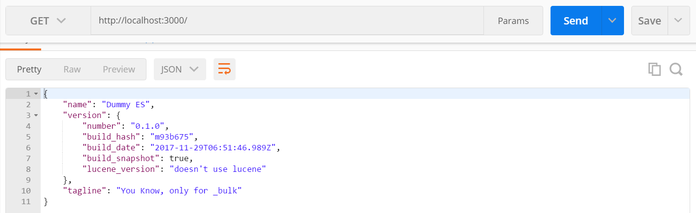

# Elasticserach Dummy Responder (Success)

=========================================

Dummy server to mimic elasticsearch success response upon receiving bulk post requests. I personally use this simple app for testing codes I developed, especially the one that require interaction with elasticsearch server for sending bulk post
request.

## Installation

To install this application, the following requirements needs to be met

* nodejs ^6.0.0
* npm ^5.0.0

then clone this repository using the following command

```bash
git clone https://github.com/rimaulana/elasticsearch-dummy-success-responder.git
```

once the codes were downloaded, cd into the directory and then run

```bash
npm install
```

## Running the service

To run the service simply run

```bash
npm run server
```

by default this application will listen to port 3000. However, it can simply be configure by changing it in config.json file.

```json
{
    "port": 3000
}
```

## Testing with postman

In order to check whether this app is running, it can simply be tested by sending request to this app using postman.

### Setting URL and METHOD

Method should be POST and url will depend on the config. However, the default would be http://localhost:3000/_bulk


### Defining Content-Type header

The acceptable Content-Types header are

* application/json
* text/plain


### Defining body

body needs to be set to raw, for testing purpose, use the following body

```text
{ "index" : { "_index" : "test", "_type" : "type1", "_id" : "1" } }
{ "field1" : "value1" }
{ "delete" : { "_index" : "test", "_type" : "type1", "_id" : "2" } }
{ "create" : { "_index" : "test", "_type" : "type1", "_id" : "3" } }
{ "field1" : "value3" }
{ "update" : {"_id" : "1", "_type" : "type1", "_index" : "test"} }
{ "doc" : {"field2" : "value2"} }
```


### Getting response

response should look like following

```json
{
    "took": 30,
    "errors": false,
    "items": [
        {
            "index": {
                "_index": "test",
                "_type": "type1",
                "_id": "1",
                "_version": 1,
                "result": "created",
                "_shards": {
                    "total": 2,
                    "successful": 1,
                    "failed": 0
                },
                "status": 201,
                "_seq_no": 0,
                "_primary_term": 1
            }
        },
        {
            "delete": {
                "_index": "test",
                "_type": "type1",
                "_id": "2",
                "_version": 1,
                "result": "deleted",
                "_shards": {
                    "total": 2,
                    "successful": 1,
                    "failed": 0
                },
                "status": 200,
                "_seq_no": 1,
                "_primary_term": 2
            }
        },
        {
            "create": {
                "_index": "test",
                "_type": "type1",
                "_id": "3",
                "_version": 1,
                "result": "created",
                "_shards": {
                    "total": 2,
                    "successful": 1,
                    "failed": 0
                },
                "status": 201,
                "_seq_no": 2,
                "_primary_term": 3
            }
        },
        {
            "update": {
                "_index": "test",
                "_type": "type1",
                "_id": "1",
                "_version": 2,
                "result": "updated",
                "_shards": {
                    "total": 2,
                    "successful": 1,
                    "failed": 0
                },
                "status": 200,
                "_seq_no": 3,
                "_primary_term": 4
            }
        }
    ]
}
```

## Health check

This app has health check utility for making sure that the service is running via GET and POST method on / path. the request send should return

```json
{
    "process": "Health check",
    "version": "0.1.0",
    "ok": true
}
```




